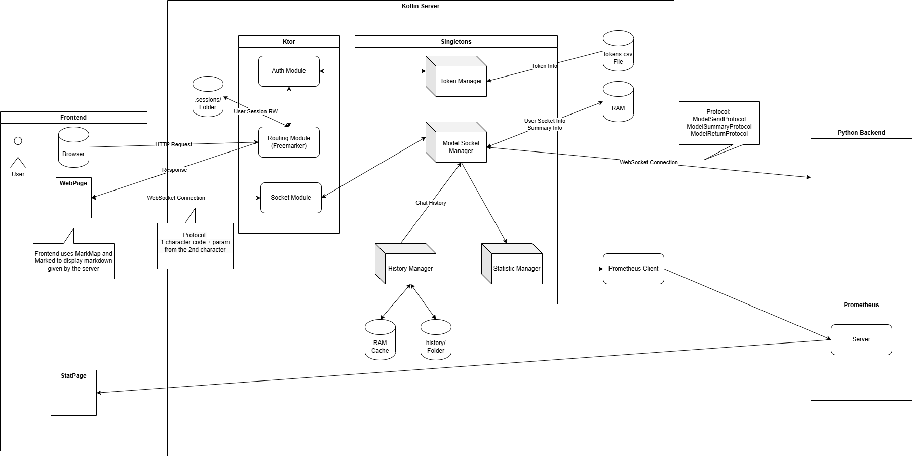

# ChatPA

运行方式：
`java -jar chatpa.jar -config=application.yaml`

启动后需要初始化和模型端的WS连接:
登录管理员账号后，访问`/init`

如果需要启用数据收集功能，需要初始化该功能 ：
登录管理员账号后，访问`/inits`

如果模型端重启，需要重新连接模型端：
登录管理员账号后，访问`/init`

## 技术
服务器框架是Ktor，与用户端和模型端连接是WebSocket。

模板引擎是FreeMarker，前端UI是fomanticUI框架。

序列化使用了kotlinx.serialization，没有数据库存储。

数据收集为PrometheusClient。

## 代码导读
